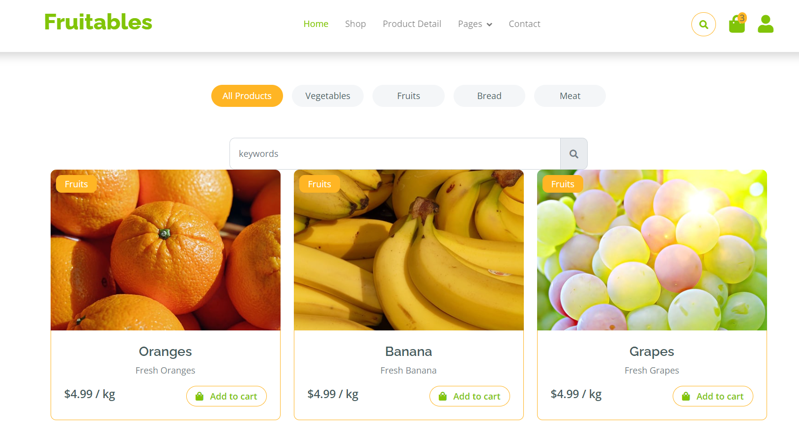

### Grocery Store Ecommerce Website

Welcome to my website! Here are some screenshots to give you a glimpse:
 
 ## Home Page

## Products

## Vegetables

## Shop Page

## Product Details Page

## Cart Page

## Checkout Page

## Contact Us

## Testimonial Page

## Admin Products Page

## Admin Add Products Page

## Key Features

- **Bootstrap 5**: Utilizes the latest Bootstrap framework for a responsive and modern layout.
  
- **HTML5 & CSS3**: Employs cutting-edge web technologies for enhanced functionality and aesthetics.

- **Burger Menu**: Offers a convenient and sleek navigation menu for easy access to site sections.

- **Breadcrumbs**: Provides users with clear navigation paths for seamless browsing.

- **Sticky Top Navigation**: Ensures easy access to navigation options as users scroll through the page.

- **Drop-Down Menu**: Organizes site content for intuitive navigation and exploration.

- **Split Header**: Divides the header section to highlight key information and promotions.

- **Hero Image**: Captivates users with visually striking imagery upon entering the website.

- **Header Carousel**: Showcases featured products or promotions in an interactive carousel.

- **Header Search Option**: Enables users to quickly find products or categories of interest.

- **Tabbed Content**: Organizes information into tabs for easy browsing and comparison.

- **Product Cards**: Presents products in visually appealing and informative card layouts.

- **Product Carousels**: Displays product collections or categories in dynamic carousels.

- **Sales Banner**: Highlights ongoing sales or promotions to attract user attention.

- **Testimonial Carousel**: Showcases customer testimonials to build trust and credibility.

- **Newsletter Subscription UI**: Allows users to subscribe to newsletters for updates and promotions.

- **Category Search Filter**: Facilitates product discovery by enabling users to filter by category.

- **Pricing Filter**: Enables users to filter products based on price range.

- **Pagination UI**: Provides easy navigation through product listings with pagination controls.

- **Comment Form UI**: Allows users to leave feedback or reviews on products or services.

- **Back-to-top Button**: Offers a convenient way for users to return to the top of the page.

- **Geolocation**: Utilizes geolocation services for personalized user experiences.

- **Contact Form UI**: Provides a user-friendly interface for contacting customer support or making inquiries.

- **Detailed Footer**: Includes comprehensive information and links for user convenience.

- **Footer Navigation**: Offers additional navigation options in the footer for easy access to site sections.

- **Clean Codebase**: Maintains a well-structured and organized codebase for easy maintenance and scalability.

- **SEO-friendly Theme**: Optimized for search engines to improve visibility and ranking.

- **Page-speed Optimized**: Ensures fast loading times for improved user experience and SEO performance.

- **Multipage Design**: Structured with multiple pages for comprehensive content organization.

- **100% Responsive**: Adapts seamlessly to various screen sizes and devices for optimal viewing experience.

- **Cross-browser Compatible**: Ensures compatibility across different web browsers for broader accessibility.

- **Admin Panel**: Allows administrators to dynamically add, delete, and update products on the website, providing flexibility and ease of management.

With these features, our Grocery Store E-commerce Website aims to provide users with a seamless and enjoyable shopping experience.

### HOW TO RUN THIS APP

## Available Scripts

In the Backend directory, you can run

### `npm start`

In the Frontend directory, you can run:

### `npm run dev`

Runs the app in the development mode.\
Open [http://localhost:5173](http://localhost:5173) to view it in your browser.

The page will reload when you make changes.\
You may also see any lint errors in the console.